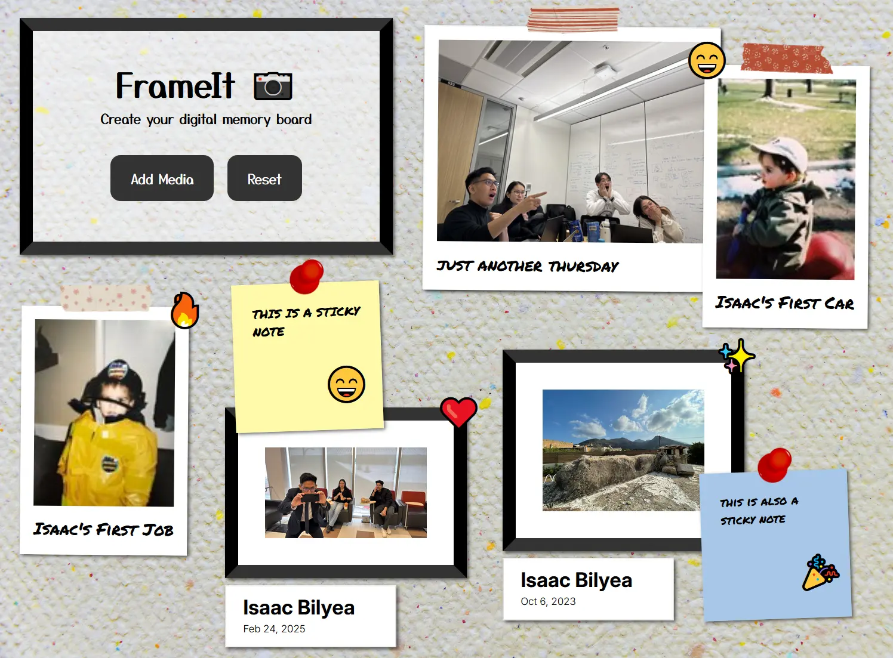

# FrameIt - Interactive Digital Memory Board 📷

Welcome to FrameIt! This project demonstrates object-oriented JavaScript principles through an interactive digital memory board. Users can create and arrange various media types, offering a customizable and engaging experience for organizing digital memories.

## Table of Contents 📋
1. [Features](#features)
2. [Skills](#skills)
3. [Installation](#installation)
4. [Usage](#usage)
5. [License](#license)

## Features ✨ 

- **Photos** 🖼️- Photos with frames and date plaques
- **Polaroids** 📸 - Polaroid-style images with filters
- **Sticky Notes** 📝 - Colourful sticky notes
- **Stickers** ⭐ - Draggable emoji stickers

## Skills 🛠️ 

Here's what you'll find showcased in this project:

- **Languages**: HTML5, CSS3, JavaScript (ES6+ OOP)
- **Preprocessors**: Sass (SCSS)
- **Frameworks and Libraries**: GreenSock (GSAP)
- **Build Tools**: Parcel.js
- **Tools**: Git, VS Code

## Installation 📦 

To explore the site locally:

1. Clone the repository
2. Navigate to project directory
3. Open index.html in your browser or use Live Server in VS Code

## Usage ⚙️ 
1. Click "Add Media" to open creation modal
2. Select desired media type
3. Add content and customize
4. Drag elements to arrange
5. Use reset button to clear board

## License 📄 
This project is licensed under the MIT License. For more details, refer to the [LICENSE](LICENSE) file in the repository.
